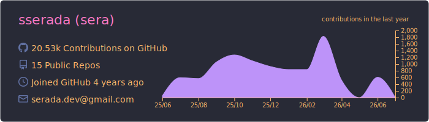
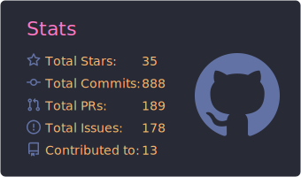
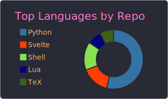

  
  

# Hi, I'm So 👋

Master's Student | Incoming Data Scientist

## 💻 Tech Stack

- **Languages**: TypeScript (Svelte, Vue), Python, LuaScript
- **Tools**: Docker, Neovim, GitHub Actions

## 🚀 Recent Projects

<!-- RECENT-PROJECTS:START -->
- [image-to-svg](https://github.com/sserada/image-to-svg) — Modern raster to vector converter powered by VTracer. Svelte + FastAPI with support for PNG/JPG, batch conversion, and  real-time tracking. (Last update: 2026-04-15)
- [dfcontext](https://github.com/sserada/dfcontext) — Generate optimal LLM context from pandas DataFrames within a token budget. (Last update: 2026-04-06)
<!-- RECENT-PROJECTS:END -->

## 📊 GitHub Stats

